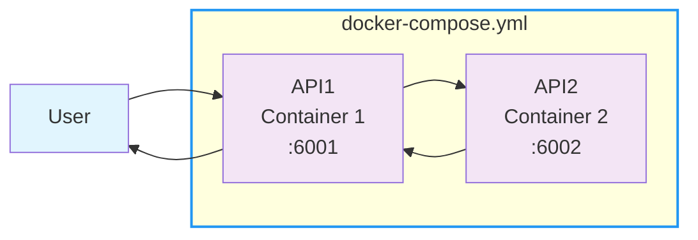

# Two-API System with Docker Compose

## Overview
This project consists of two Rust microservices built with Axum:
- **API1** (Port 6001): Gateway API that receives user requests and forwards them to API2
- **API2** (Port 6002): Processing API that handles requests and returns responses

## Architecture



## Prerequisites
- Docker
- Docker Compose

## Project Structure
```
.
├── api1/
│   ├── src/main.rs
│   ├── Cargo.toml
│   └── Dockerfile
├── api2/
│   ├── src/main.rs
│   ├── Cargo.toml
│   └── Dockerfile
├── docker-compose.yml
└── README.md
```

## Deployment

### 1. Clone and Navigate
```bash
git clone https://github.com/MoosaTae/Quiz-ai4thai-hackathon
cd Quiz-ai4thai-hackathon
```

### 2. Build and Start Services
```bash
docker-compose up --build
```

### 3. Alternative: Run in Background
```bash
docker-compose up --build -d
```

## Testing

### Health Checks
```bash
# API1 Health Check
curl http://localhost:6001/health

# API2 Health Check
curl http://localhost:6002/health
```

### Main Functionality
```bash
# Send request to API1 (which forwards to API2)
curl http://localhost:6001/hello
```

### Expected Response
```json
{
  "message": "Hello from API1!",
  "api2_response": {
    "message": "Hello World from API2!",
    "processed_at": "2025-07-20T11:59:12.979499497Z",
    "status": "success",
    "data": {
      "greeting": "สวัสดี",
      "language": "Thai",
      "random_number": 42
    }
  },
  "timestamp": "2025-07-20T11:59:12.980139167Z"
}
```


## API Endpoints
- API1: http://localhost:6001/health and http://localhost:6001/hello
- API2: http://localhost:6002/health and http://localhost:6002/process

## Stopping Services
```bash
docker-compose down
```

## Development
Both APIs are built using:
- **Rust**: Systems programming language
- **Axum**: Web framework for Rust
- **Tokio**: Async runtime
- **Reqwest**: HTTP client (API1 only)
- **Serde**: Serialization framework